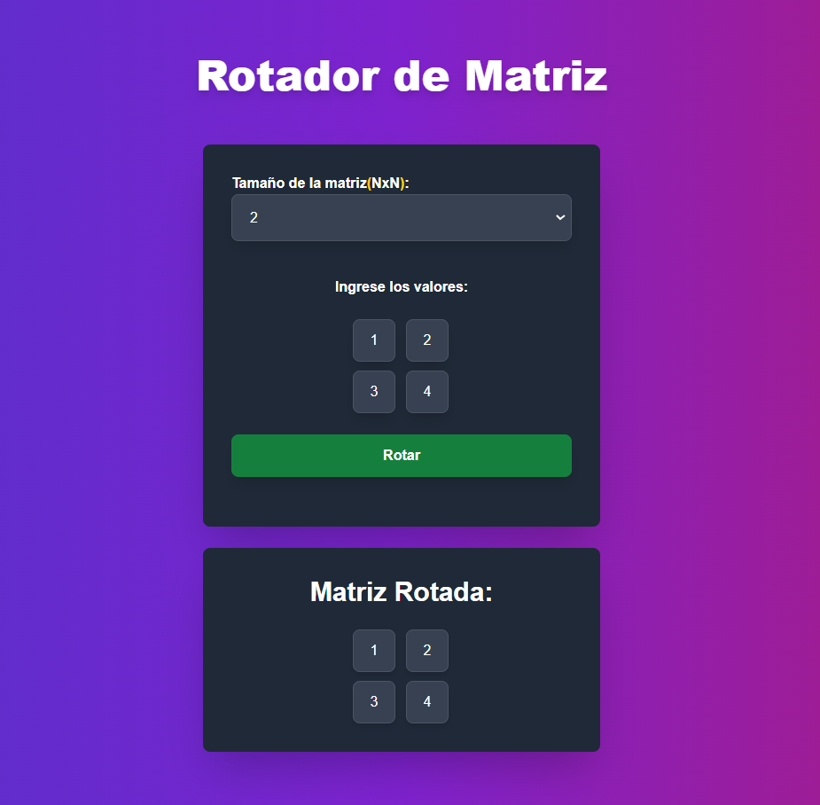

## Documentación del Proyecto

### Configuración del Proyecto

1. **Clonar el repositorio:**

    ```bash
    git clone https://github.com/gacc94/prueba_tecnica_nestjs_delosi.git
    ```

2. **Instalar dependencias:**

    ```bash
    npm install
    # o
    yarn install
    # o
    pnpm install
    ```

### Ejecutar el Servidor de Desarrollo

Para iniciar el servidor de desarrollo, ejecuta:

```bash
npm run dev
# o
yarn dev
# o
pnpm dev
# o
bun dev
```

Abre [http://localhost:3000](http://localhost:3000) en tu navegador para ver la aplicación.

### Ejecutar Pruebas

Para ejecutar las pruebas del proyecto, usa el siguiente comando:

```bash
npm run test
# o
yarn test
# o
pnpm test
```

### Contacto

Para cualquier pregunta o comentario, por favor contacta a [gustavocaqui_94@gmail.com](gustavocaqui_94@gmail.com).

### Demostración del Rotador de Matrices

A continuación se muestra una imagen que demuestra la funcionalidad del rotador de matrices:



Puedes ver la demostración en vivo en [https://prueba-tecnica-nextjs-delosi.vercel.app/](https://prueba-tecnica-nextjs-delosi.vercel.app/).